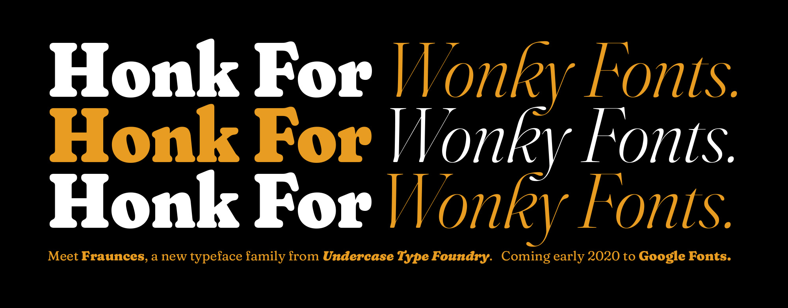

# Fraunces Font Project

Fraunces is a display, "Old Style" soft-serif typeface inspired by the mannerisms of early 20th century typefaces such as [Windsor](http://fontreviewjournal.com/windsor/), Souvenir, and the Cooper Series.

This typeface family is still under development, and will be ready for initial release by early 2020.

## Variable Axes

Fraunces has the following axes:

Axis | Tag | Range | Default | Description
--- | --- | --- | --- | ---
Optical Size | opsz | 9pt to 144pt | 72pt | Labeled 9pt, 72pt, and 144pt in instances.
Weight | wght | 100 to 900 | 400 | Labeled Thin, Light, Regular, Semibold, Bold, and Black in instances.
Softness | SOFT | 000 to 100 | 050 | Labeled S000, S050, and S100 in instances.
Wonky | WONK | 0 to 1 | 1 | Binary axis controls substitution of "wonky" characters. Automatically substitutes when opsz > 18. Not listed in instances.

### `opsz` (Optical Size) Axis

The `opsz` axis ties together changes in contrast, x-height, spacing, and character widths. As `opsz` decreases, the x-height increases, spacing opens up, and the characters expand in width.

Additionally, mapping of axis values is placed in the AVAR table to create non-linear interpolation in the Variable font.

Many of the peculiar, wonky characteristics that are suitable for display usage are less desirable for more continuous reading. At certain smaller optical sizes (18px and less), the `wonk` axis is disabled (see below). 

### `wght` (Weight) Axis

The `wght` axis spans Thin to Black. Nuff said.

### `SOFT` (Softness) Axis

The `SOFT` axis gives access to the softer, rounded forms that are available towards the Optical Min, but still retaining other Optical Sizing considerations, such as change in character width, spacing, tall ascenders, and shorter x-height

### `WONK` (Wonky) Axis

A binary axis that subsitutes `wonk` characters for more normalized characters, such as the leaning n/m/h in Roman, or the bulbous flags in the b/d/h/k/l of the Italic. In traditional instances of fonts, this will be implemented as a Stylistic Set.

